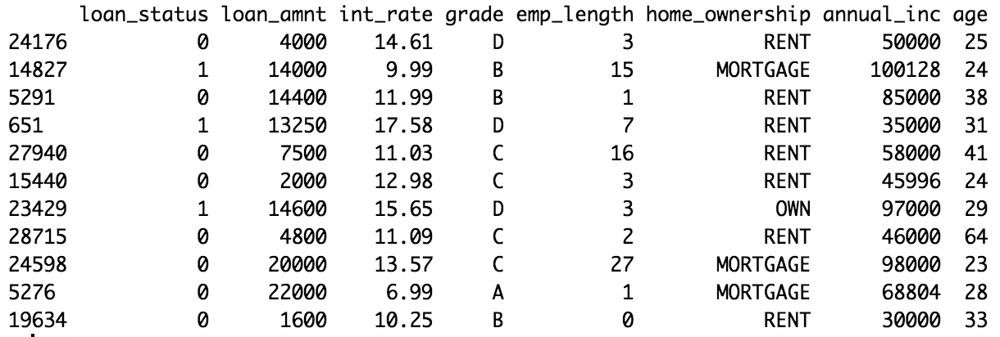

# Loan risk binary classification using logistic and tree models 

## Data 
'data.frame':	26315 obs. of  8 variables: 
 $ loan_status   : int  0 0 0 1 0 1 0 0 0 1 ... 
 $ loan_amnt     : int  5000 10000 12000 9000 3000 10000 1000 3600 9200 21000 ... 
 $ int_rate      : num  10.65 13.49 12.69 13.49 9.91 ... 
 $ grade         : Factor w/ 7 levels "A","B","C","D",..: 2 3 2 3 2 2 4 1 1 2 ... 
 $ emp_length    : int  10 13 11 0 3 3 0 13 6 17 ... 
 $ home_ownership: Factor w/ 4 levels "MORTGAGE","OTHER",..: 4 4 3 4 4 4 4 1 4 4 ... 
 $ annual_inc    : num  24000 49200 75000 30000 15000 ... 
 $ age           : int  33 24 28 22 22 28 22 27 24 29 ... 
 

